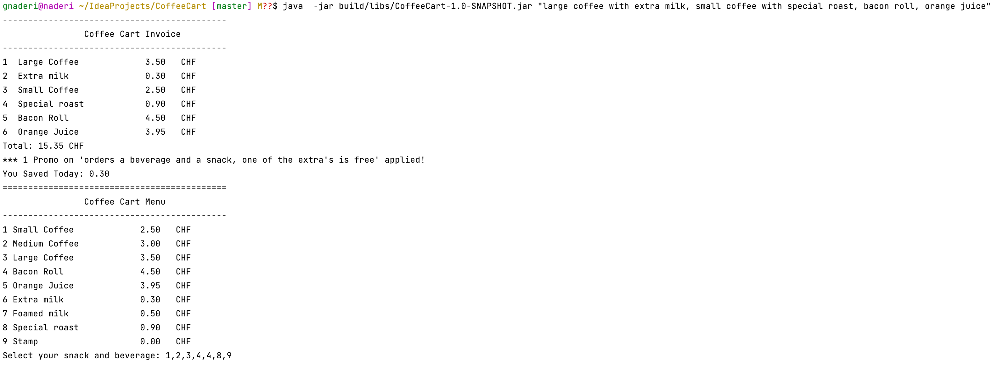

# CoffeeCart
 ## Ghodrat's Coffee Cart
Recently, Ghodrat decided to open his very own little coffee cart on a busy street corner.
Being the careful entrepreneur, she decided to start off with a limited offering, with the option to expand his choice of products, as business goes.

 ## Offering  Products
- Coffee (small, medium, large) 2.50 CHF, 3.00 CHF, 3.50 CHF - Bacon Roll 4.50 CHF
- Freshly squeezed orange juice (0.25l) 3.95 CHF
  ###  Extras:
- Extra milk 0.30 CHF
- Foamed milk 0.50 CHF
- Special roast coffee 0.90 CHF
## Bonus Program
  Ghodrat's idea is to attract as many regular‘s as possible to have a steady turnaround. She decides to offer a customer stamp card, where every 5th beverage is for free.
  If a customer orders a beverage and a snack, one of the extra's is free.
  Your task is to:
  Write a simple program whose output is formatted like a receipt you would receive at a supermarket.
  The input to the program is a list of products the shopper wants to purchase (large coffee with extra milk, small coffee with special roast, bacon roll, orange juice)

## Build and Run the  app
This is a gradle project that using gradle  wrapper 7.4.1  compatible  with jdk17
### How to Build?
To build the project download the  source code and cd into  it.
- `cd CoffeeCart`
- `./gradlew clean build`  
### How To Run the CoffeeCart app?
- Run from command line/terminal
- `java  -jar build/libs/CoffeeCart-1.0-SNAPSHOT.jar "large coffee with extra milk with foamed milk"`
- `java  -jar build/libs/CoffeeCart-1.0-SNAPSHOT.jar`
  - This will show a Menu with list of options(select id comma seperated). i.e 1,2,3,4,4,3 
  